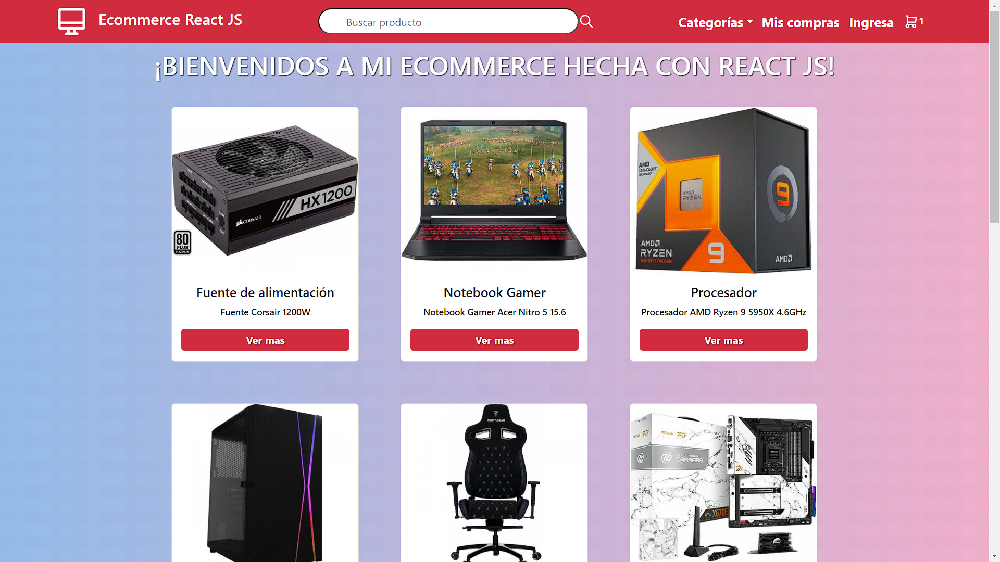

# Ecommerce React JS CoderHouse 2024 🌍

Entrega del proyecto final, este proyecto constará de una tienda ecommerce, desarrollada con
React JS con vite,Javascript, HTML, CSS, Tailwind , Bootstrap y FireBase como base de datos.

    

 
    

         
     

# Deploy del proyecto

* https://frontendreactjscoder.netlify.app/

# Acerca de como ejecutar la aplicación:

* Clonar el repositorio haciendo uso del comando: git clone https://github.com/DarioLopez18/EntregaFinalLopez
* Posicionarse dentro de la carpeta del proyecto, navegar desde la terminal o abriendo directamente la carpeta
* Instalar las dependencias con el comando: npm install o npm i
* Una vez instalada la dependencia correr la aplicación con el comando: npm run dev
* Se mostrará un link al localhost desde la terminal, hacer ctrl + click o command + click o simplemente pegar en el navegador el link.

# Acerca de la entrega: 

* Consigna: Desarrollaras una app de una e-commerce para poder vender productos de un rubro a eleccion
* Componentes:
* Button
* Cart
* CartItem
* CartWidget
* Checkout
* CheckoutItem
* Dropdown
* Enlace
* Error
* Footer
* Icon
* Item
* ItemCount
* ItemDetail
* ItemDetailContainer
* ItemList
* ItemListContainer
* Loader
* Navbar
* Pagination
* Search

# Se debe entregar:

* Navbar
* CartWidget
* ItemListContainer
* ItemList
* ItemDetailContainer
* ItemDetail
* Checkout

# Información de la aplicación:

* El proyecto constará de una tienda ecommerce de productos de hardware y tecnología.
* Se utilizarán productos sacados desde Compra Gamer. 
* Se utiliza firebase como base de datos.
* CartContext para el manejo del carrito
* Navegacion con react-router-dom
* La aplicacion cuenta con:
* Pagina principal donde hay un listado de productos
* Pagina de detalle del producto luego de hacer click
* Pagina para el carrito
* Pagina para el checkout
* Manejo de estados, rendering condicional, estilos responsivos.
* Filtrado con barra de productos,
* Paginado para ver los productos en distintas paginas
* Validacion de formulario con expresiones regulares

# Dependencias del proyecto:

* "@headlessui/react": "^1.7.18"
* "@heroicons/react": "^2.1.1"
* "react-dotenv": "^0.1.3"
* "dotenv": "^16.4.4"
* "bootstrap": "^5.3.2"
* "bulma": "^0.9.4"
* "firebase": "^10.8.0"
* "firebase-admin": "^12.0.0"
* "react": "^18.2.0"
* "react-bootstrap": "^2.10.0"
* "react-dom": "^18.2.0"
* "react-router-dom": "^6.21.3"
* "reactstrap": "^9.2.1"
* "sweetalert2-react-content": "^5.0.7"
* "vite-plugin-env-compatible": "^2.0.1"
* iconos: https://tabler.io/icons

# Datos del cursado
- **Año: 2024**
- **Comisión: 60810**
- **Profesor: Diego Andres Alvarado Valle**
- **Tutor adjunto: Lisandro Cordoba**

# Tecnologías utilizadas

* 
* 
* 
* 
* 
* 
# Desarollado por:

* Nombre👤: Lopez, Dario Angel Jose.
* gmail📩: darioangellopez38@gmail.com
* Linkedin💻: https://www.linkedin.com/in/dario-angel-jose-lopez-2a3202234/

(<a href="#top">Volver Arriba</a>)
